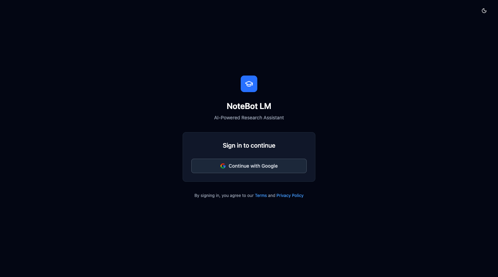
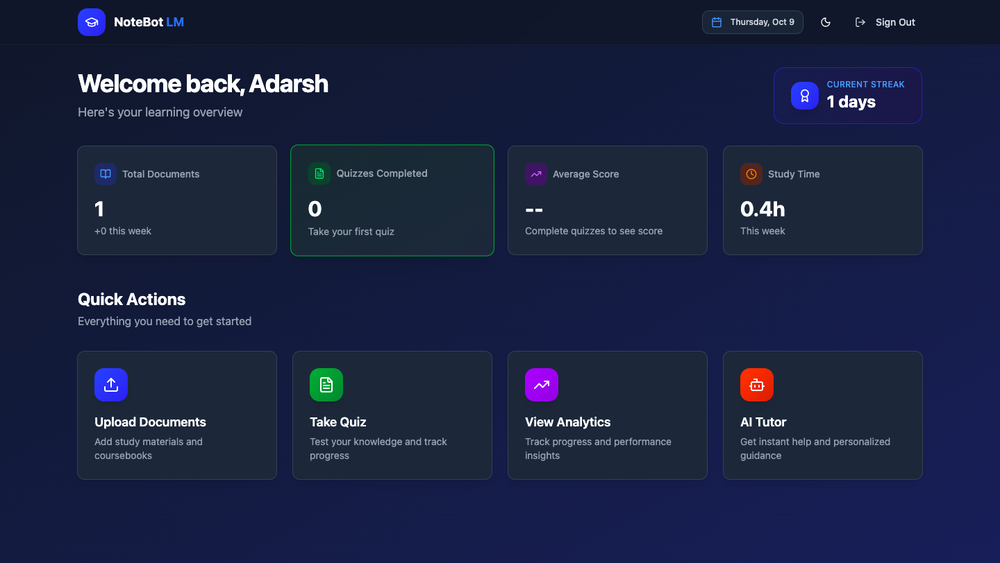

# 📘 NoteBot LM – AI-Powered Study & Revision Assistant

NoteBot LM is an intelligent web app designed to help students revise their course materials.
Upload any PDF to generate dynamic quizzes (MCQs, SAQs, LAQs) tailored to the content.
Engage with an AI tutor that provides RAG-based answers with citations from the source text.
Track your progress and deepen your understanding for a more effective learning experience.

**🌐 Live Demo:** [Access NoteBot LM](https://www.notebotlm.xyz)

## ✅ Core Features

- 📚 **PDFs & Coursebooks** – Upload and manage all your course materials in one place.
- 🧠 **AI Quiz Generation** – Instantly create quizzes (MCQs, SAQs, LAQs) from any document.
- 🤖 **Intelligent Chat Tutor** – Ask questions and get cited, RAG-powered answers directly from your texts.
- 📊 **Progress & Analytics** – Track your strengths and weaknesses with a simple dashboard.
- ✅ **Source Citations** – Every AI-generated answer includes the page number and a direct quote for easy verification.
- 📄 **Interactive PDF Viewer** – Read and chat side-by-side with a clean, split-view interface.
- 🎥 **Video Recommendations** – Get relevant YouTube videos suggested for any topic you're studying.

## 🛠 Tech Stack

### **Client (Frontend)**

- ⚛️ **Next.js 15+** – React framework for full-stack web applications, including server-side rendering and routing.
- 🎨 **Tailwind CSS** – Utility-first CSS framework for rapid and responsive UI development.
- ✨ **Shadcn UI** – Beautifully crafted UI components built with Radix UI and Tailwind CSS.
- 📝 **@react-pdf-viewer** – Robust PDF viewing capabilities with features like search, highlight, and page navigation.
- ⚡ **@tanstack/react-query** – Powerful data fetching and state management for server data.
- 💡 **Lucide React** – A collection of beautiful and customizable open-source icons.
- 🌗 **Next-Themes** – Easy integration of light and dark mode themes.

### **Server (Backend & AI)**

- 🟢 **tRPC** – End-to-end typesafe APIs, allowing full type inference from backend to frontend.
- 🗄 **PostgreSQL + Prisma** – Relational database provided by Supabase with a next-generation ORM for simplified database access.
- 🔒 **NextAuth.js** – Flexible authentication for Next.js applications, supporting Google OAuth.
- 📦 **Qdrant** – High-performance vector similarity search engine, used for storing document embeddings.
- ⚙️ **BullMQ** – Robust, Redis/Valkey-backed job queue for handling background tasks like PDF processing.
- 🧠 **Google Gemini** – Advanced LLM for generating quiz questions, chat responses, and video recommendations.
- 🤗 **HuggingFace Inference** – Utilized for generating high-quality embeddings from PDF chunks.
- ⛓️ **LangChain** – Framework for developing applications powered by language models, used for document chunking and RAG pipeline.

### **Infrastructure**

- 🐳 **Docker** – Used for containerized development and deployment.
- ☁️ **Vercel** – Frontend hosting for Next.js app.

## Installation & Running Locally

Follow these steps to set up and run NoteBot LM on your local machine:

```bash
# Clone the repository

git clone <your-repository-url>

cd <your-repository-directory>

# Install dependencies

npm install

# Duplicate .env.example and rename it to .env

cp .env.example .env

# Start Docker Services

docker-compose up -d

# Verify that the containers are running

docker-compose ps

# Initialize the database

npx prisma migrate dev

npx prisma generate

# Run the application

npm run dev

```

## 📸 Screenshots

### Auth Page



### Dashboard Page



### Document Page


### Quiz Page


### Chat Page


### Light Mode Page


## 📄 License

This project is licensed under a **Custom Personal Use License** — you may view and learn from the code, but **commercial use, redistribution, or claiming authorship is strictly prohibited**.  
See the full [LICENSE](./LICENSE) for details.
